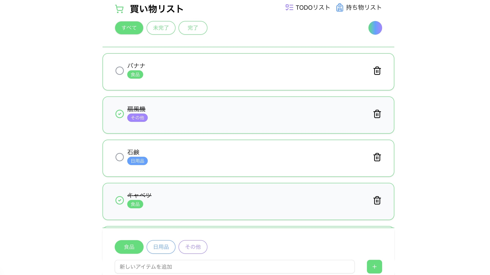

## The-View

   

## URL

## 概要

The-View は、買い物リスト・TODO リスト・持ち物リストを一つのアプリにまとめ、用途に応じて簡単に切り替えることができるタスク管理アプリです。 
リストごとにタグを付けて視認性を向上させ、テーマカラーの切り替えにも対応しています。 
また、スマートフォンでの使用を前提としたモバイルファースト設計で構築しています（掲載のスクリーンショットは PC 表示です）。 

## サービスへの想い

３つのアプリには共通点が多いため、カスタムフックス、型ガード、ジェネリクス型を利用し保守性の高いコードを実現しました。 
タスクの追加には form actions を利用しています。 
フォームには zod と react-hook-form を利用してます。

## 使用技術

- フロントエンド React 19 Next.js 15.3.3 TypeScript 5
- スタイリング Tailwind CSS shadcn/ui
- バックエンド supabase
- デプロイ vercel
